# IndiaAI Financial Reporting Compliance Challenge
## Phase 1 — Methodology & Technical Approach

---

## 1. Problem Statement

NFRA requires an automated system that can analyze publicly available annual reports of Indian listed entities, evaluate their compliance against specific accounting standards and regulatory provisions, and produce **explainable, evidence-backed** compliance assessments.

The core challenges are:

- Annual reports are unstructured PDFs with inconsistent layouts across companies
- Compliance evaluation requires **multi-step reasoning** across different sections of the same report (e.g., cross-referencing the Auditor's Report with Notes to Accounts and the Balance Sheet)
- Outputs must be **explainable** — not just a label, but a traceable reasoning path with exact evidence and page references

---

## 2. Solution Architecture

Our MVP is a **two-stage pipeline**: intelligent document extraction followed by agentic compliance reasoning.

```mermaid
graph TB
    subgraph "STAGE 1 — Document Intelligence"
        A["📄 PDF Annual Report"] --> B["Azure Document Intelligence<br/>(prebuilt-layout)"]
        B --> C["Paragraphs + Tables<br/>(structured objects)"]
        C --> D["TOC Detection<br/>(table or paragraph scan)"]
        D --> E["Page Offset Calibration<br/>(printed vs PDF page numbers)"]
        E --> F["Section Segmentation<br/>(TOC page ranges → sections)"]
        F --> G["Table → Markdown<br/>+ Paragraph De-duplication"]
        G --> H["📁 Company Folder<br/>Balance Sheet.md<br/>P&L.md<br/>Auditor Report.md<br/>Notes.md<br/>..."]
    end

    subgraph "STAGE 2 — Agentic Compliance Reasoning"
        I["📊 Rules Excel<br/>(Accounting Standards)"] --> J["Rule Parser<br/>Questions + Target Sections<br/>+ Failure Triggers"]
        H --> K["Section Loader<br/>+ Fuzzy Matcher"]
        J --> L
        K --> L

        subgraph "LangGraph Workflow (per company × per rule)"
            L["🟢 INIT"] --> M["🔵 PROCESS QUESTION<br/>Retrieve target sections<br/>Build cross-section context<br/>LLM analyzes evidence"]
            M --> N["🟡 VALIDATE<br/>Senior auditor review<br/>Evidence quality check<br/>Confidence calibration"]
            N --> O["⚪ INCREMENT"]
            O -->|"More Qs"| M
            O -->|"Done"| P["🔴 EVALUATE TRIGGERS<br/>Apply failure logic<br/>from rules Excel"]
            P --> Q["🟣 BUILD OUTPUT<br/>Reasoning path<br/>Evidence trail<br/>Compliance verdict"]
        end
    end

    Q --> R["📋 Compliance Matrix.xlsx<br/>Company × Rule × Status<br/>+ Evidence + Reasoning"]

    style A fill:#e3f2fd
    style H fill:#e8f5e9
    style R fill:#fff3e0,stroke:#e65100,stroke-width:2px
    style M fill:#bbdefb
    style N fill:#fff9c4
    style P fill:#ffcdd2
```



---

## 3. Stage 1 — Intelligent Document Extraction

### 3.1 Why This Matters

Indian annual reports vary enormously in structure. The same company may have a 60-page report one year and 150 pages the next. Sections appear in different orders. Table layouts are inconsistent. Page numbering often doesn't start at page 1 of the PDF.

A naive approach (feeding the entire PDF to an LLM) fails because:
- Token limits are exceeded (100+ page reports)
- The LLM loses focus when searching for a specific figure across 50,000 tokens of irrelevant content
- There is no traceability — you can't point to where evidence came from

### 3.2 Our Approach: TOC-Anchored Section Extraction

```mermaid
flowchart LR
    A["PDF"] --> B["ADI Layout<br/>Analysis"]
    B --> C{"TOC<br/>Found?"}
    C -->|Yes| D["Parse TOC<br/>Section → Page Map"]
    C -->|No| E["❌ Error:<br/>TOC Required"]
    D --> F["Detect Page<br/>Offset"]
    F --> G["Assign Pages<br/>to Sections"]
    G --> H["De-duplicate<br/>Paragraphs vs Tables"]
    H --> I["Output .md<br/>per Section"]
```



**Key techniques:**

| Challenge | Solution |
|-----------|----------|
| TOC is a table vs. plain text | Dual detection: scan tables first (header keyword matching), fall back to paragraph pattern matching (`Section ... 42`) |
| Balance Sheet table misidentified as TOC | Strict validation: reject entries containing financial amounts; require page coverage ≥ 30% of document |
| Printed page ≠ PDF page (offset of 4, 6, etc.) | **Dynamic offset detection**: scan footer numbers at the bottom of pages, compute `offset = printed_page - pdf_page` via majority vote across all pages |
| ADI returns table content as both table objects AND paragraphs | **Bounding-box de-duplication**: compute each table's (page, top_y, bottom_y) zone, skip any paragraph whose position falls within a table zone |
| Section names vary across companies | **Canonical mapping**: 15+ regex patterns match common Indian annual report sections ("Statement of Profit and Loss" ↔ "Profit & Loss Account" ↔ "P&L Statement") |

### 3.3 Output

Each company produces a folder of clean Markdown files:

```
Extracted_Reports/
  Vikas WPS Annual report_sections/
    Balance Sheet.md
    Statement of Profit and Loss.md
    Cash Flow Statement.md
    Independent Auditor's Report.md
    Notes to Financial Statements.md
    Directors' Report.md
    Corporate Governance Report.md
    ...
```

Each `.md` file contains properly formatted text and tables that an LLM can directly reason over.

---

## 4. Stage 2 — Agentic Compliance Reasoning

### 4.1 Why an Agent, Not a Single Prompt?

Compliance evaluation is inherently **multi-step** and **cross-sectional**. Consider Rule R1 (NPA loan interest recognition):

1. First, check the **Auditor's Report** for CARO Clause 9 (loan defaults)
2. If defaults exist, check the **same report** for default duration (≥ 90 days)
3. Then cross-reference with **Notes to Accounts** — did the company disclose NPA status?
4. Then check the **P&L + Balance Sheet** — is the interest-to-borrowings ratio suspiciously low?
5. Finally, apply **failure trigger logic** combining all findings

Each step depends on the previous one. A single prompt cannot reliably chain this reasoning. This is why we use **LangGraph** — a stateful, graph-based orchestration framework.

### 4.2 Workflow Design


### 4.3 Node-by-Node Breakdown

#### NODE 1: Init
Resets the state for each (company, rule) pair. Initializes question index, response accumulators, and compliance fields.

#### NODE 2: Process Question (Core Reasoning)
This is where cross-section reasoning happens:

1. **Section Retrieval** — The question specifies target sections (e.g., `[Independent Audit Report]`). The fuzzy matcher finds the corresponding `.md` file from the extracted report, handling name variations across companies.

2. **Cumulative Context** — All prior Q&A responses are included in the prompt. This means when Q4 asks "Has the auditor mentioned non-accounting of interest?", it already knows from Q1–Q3 that defaults exist and are ≥ 90 days.

3. **Financial Calculations** — For questions involving quantitative checks (e.g., interest/borrowings ratio), structured calculation instructions are injected into the prompt with explicit numerator/denominator definitions.

4. **Evidence Extraction** — The LLM is instructed to quote exact text or table values, not paraphrase.

#### NODE 3: Validate
A second LLM pass simulating a **senior auditor review**:
- Is the evidence specific and verifiable?
- Does the reasoning logically support the conclusion?
- Adjusts the confidence score if evidence is weak

This dual-pass approach significantly reduces hallucination and overconfident conclusions.

#### NODE 4: Increment
Moves to the next question. The routing function either loops back to Node 2 or proceeds to trigger evaluation.

#### NODE 5: Evaluate Failure Triggers
After all questions are answered, the failure trigger logic from the rules Excel is applied **exactly as stated**:

```
IF (Auditor has declared that the Company has not accounted for/charged
    the interest on NPA loans to its P&L) OR (Company has declared the same)
    → NON-COMPLIANT

IF (Company declared NPA by banks AND financial check < 6%)
    → FLAG FOR CHECKING
```

The LLM evaluates each condition against the accumulated evidence and produces the final verdict.

#### NODE 6: Build Output
Assembles all fields for the Compliance Matrix: reasoning path, combined evidence, section references, and confidence score.

### 4.4 Intelligent Section Matching

Reports from different companies use different section names. Our fuzzy matcher handles this:

```mermaid
flowchart TD
    A["Target: 'Independent Audit Report'"] --> B{"Exact match?"}
    B -->|No| C{"Alias lookup?<br/>'independent audit report'<br/>→ 'independent auditor's report'"}
    C -->|No| D{"Substring match?<br/>'audit report' in<br/>'Independent Auditor's Report'"}
    D -->|No| E{"Keyword overlap?<br/>≥ 2 shared words"}
    B -->|Yes| F["✅ Return section"]
    C -->|Yes| F
    D -->|Yes| F
    E -->|Yes| F
    E -->|No| G["⚠ Section not found"]
```



The alias table covers common Indian annual report naming conventions across hundreds of companies.

---

## 5. Output Schema — Compliance Matrix

Each (company × rule) evaluation produces one row:

| Column | Description |
|--------|-------------|
| **Company Name** | Legal entity name |
| **Rule ID** | From the rules configuration |
| **Compliance Status** | `Compliant` / `Non-Compliant` / `Partial` |
| **Summary Finding** | 2–3 sentence high-level verdict |
| **Auditor Oversight** | Whether the statutory auditor missed this issue |
| **Reasoning Path** | Full step-by-step Q&A trail showing how the conclusion was reached |
| **Evidence Snippet** | Exact quotes and figures extracted from the report |
| **Page Ref** | Section names where evidence was located |
| **Confidence Score** | 0–100 representing AI certainty (validated by senior auditor node) |

The output Excel is color-coded: green for Compliant, red for Non-Compliant, yellow for Partial (needs manual review).

---

## 6. Why This Approach — Key Advantages

### 6.1 Explainability First
Every compliance decision includes a complete **reasoning chain**: which sections were examined, what was found (or not found), and how the failure trigger logic was applied. This is auditable by human reviewers.

### 6.2 Cross-Section Reasoning
Unlike simple RAG (retrieve-and-answer), our agent builds cumulative context across questions. The answer to Q1 informs Q2, which informs Q3. This is essential for complex rules that span multiple report sections.

### 6.3 Separation of Concerns
The extraction pipeline (Stage 1) and reasoning engine (Stage 2) are **fully independent**:
- Stage 1 can be replaced with any document extraction method
- Stage 2 works with any set of rules — just modify the Excel
- New rules can be added without changing any code

### 6.4 Dual-Pass Validation
The validation node acts as a built-in quality control layer, reducing hallucination and overconfident assessments. This is critical for regulatory compliance where false positives and false negatives both have consequences.

### 6.5 Configurable, Not Hardcoded
Audit rules, questions, target sections, and failure triggers are all defined in Excel — **zero code changes required** to add new accounting standards or modify existing rules. This makes the system extensible for Phase 2 and beyond.

### 6.6 Scalable Architecture
The pipeline processes companies independently and rules independently:
- `N companies × M rules = N×M evaluations`
- Each evaluation is self-contained and can be parallelized
- Adding a new company = drop its PDF into the input folder

---

## 7. Technology Stack

| Component | Technology | Why |
|-----------|-----------|-----|
| Document Extraction | Azure Document Intelligence (prebuilt-layout) | Best-in-class table extraction for Indian financial documents; handles merged cells, multi-page tables |
| Section Segmentation | Custom Python (TOC-anchored) | Reliable, deterministic page-to-section mapping |
| Orchestration | LangGraph (by LangChain) | Stateful multi-step workflows with conditional routing; purpose-built for agentic reasoning loops |
| LLM | Azure OpenAI (GPT-4o) | Strong reasoning capabilities; JSON mode for structured outputs |
| Output | openpyxl | Formatted Excel with color-coding, auto-filters, and professional styling |
| Configuration | Excel-based rules | Non-technical users can modify audit rules without touching code |

---

## 8. Folder Structure

```
project/
├── Python/
│   ├── adi_extract_pipeline.py    # Stage 1: PDF → Section Markdown files
│   ├── audit_orchestration.py     # Stage 2: LangGraph compliance engine
│   └── .env                       # API keys (ADI + Azure OpenAI)
│
├── Reports_to_test/               # Input: raw PDF annual reports
│   └── COMPLETED/                 # Processed PDFs moved here
│
├── Extracted_Reports/             # Stage 1 output
│   ├── CompanyA_sections/
│   │   ├── Balance Sheet.md
│   │   ├── Statement of Profit and Loss.md
│   │   ├── Independent Auditor's Report.md
│   │   └── ...
│   └── CompanyB_sections/
│       └── ...
│
├── Accounting Standard - Rules.xlsx   # Audit rules configuration
├── Compliance Matrix.xlsx             # Final output
└── METHODOLOGY.md                     # This document
```

---

## 9. How to Run

### Prerequisites
```bash
pip install azure-ai-formrecognizer python-dotenv pandas openpyxl langgraph langchain-openai langchain-core
```

### Step 1 — Extract Reports
```bash
cd Python
python adi_extract_pipeline.py
```
Processes all PDFs in `Reports_to_test/` → outputs section `.md` files to `Extracted_Reports/`.

### Step 2 — Run Compliance Audit
```bash
python audit_orchestration.py \
    --reports "../Extracted_Reports" \
    --rules   "../Accounting Standard - Rules.xlsx" \
    --output  "../Compliance Matrix.xlsx"
```
Evaluates every company against every rule → writes formatted Compliance Matrix.

---

## 10. Limitations & Future Work

| Current Limitation | Planned Improvement |
|--------------------|-------------------|
| Requires TOC in the PDF | Add fallback heuristic-based section detection for reports without TOC |
| Single-threaded processing | Parallelize across companies using async LangGraph execution |
| Relies on LLM for financial calculations | Add deterministic calculation nodes (extract numbers → compute ratio in code) |
| English-language reports only | Extend to Hindi and regional language filings |
| Rules must be manually configured in Excel | Build a rule authoring UI with natural language → structured rule conversion |

---

*Built for the IndiaAI Financial Reporting Compliance Challenge — Phase 1 MVP*
